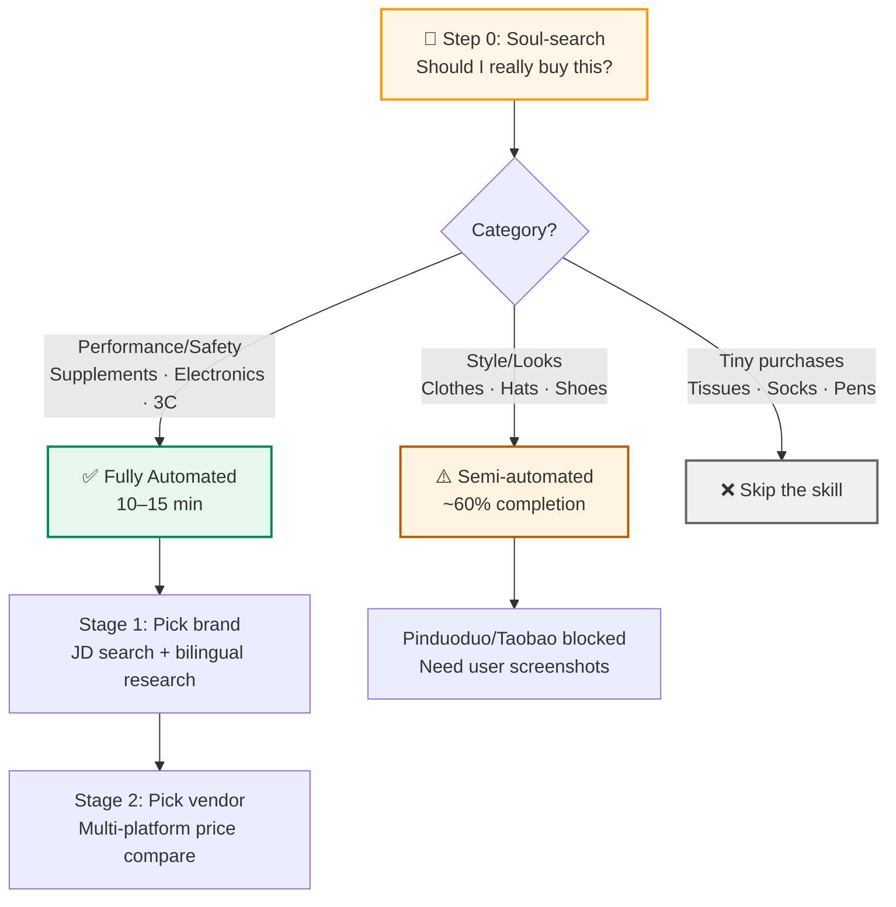
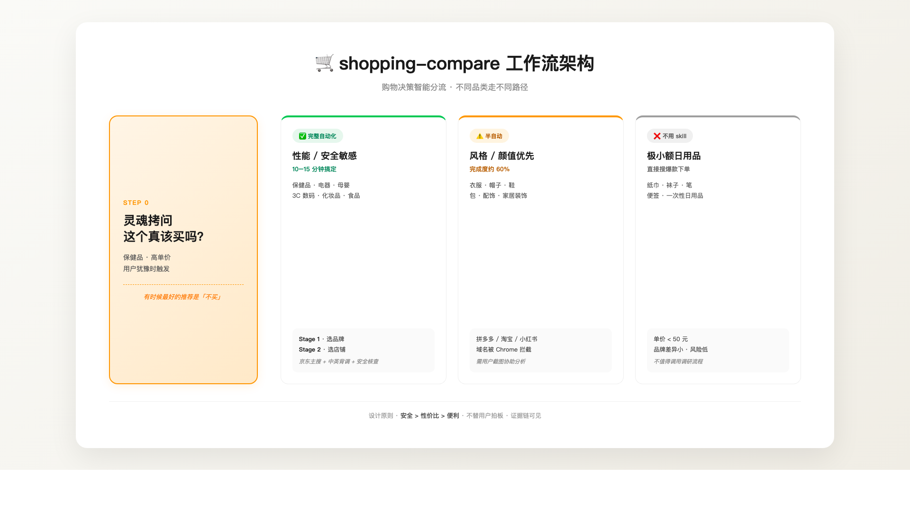

# 🛒 shopping-compare

> An AI-powered shopping assistant skill for Chinese e-commerce platforms — a cure for decision paralysis.
>
> 一个治愈选择困难症的购物助手 Skill — 帮你跨平台对比商品、识破营销话术、避开真正的雷区。

[English](#english) · [中文](#中文)



> 完整高清版架构图见 [`docs/workflow-architecture.html`](docs/workflow-architecture.html) — 浏览器打开后截图即可。

---

<a id="english"></a>

## English

### What is this

A Claude Code Skill that automates shopping decisions across Chinese e-commerce platforms (Taobao, JD, Pinduoduo, Xiaohongshu). It does the boring 80% of shopping research for you (cross-platform comparison, review aggregation, safety checks, marketing-speak detection), so you only need to do the final 20% ("do I actually want this?").

### Why I built this

I have serious decision paralysis. Every online purchase ("I want quality + value") burns hours scrolling reviews and ends with me randomly picking something, then worrying I bought a lemon. I don't want AI to decide for me — I want it to rescue me from information overload.

### What it can do ✅

- **Cross-platform comparison** with bilingual (CN/EN) background research — pulls from Reddit, Labdoor, ConsumerLab, IFOS in addition to Chinese reviews
- **Safety checks** — queries Chinese SAMR recall lists, brand controversy history, third-party lab tests
- **"Soul-search" stage** — saves you money by asking *"do you really need this?"* before researching (especially for supplements where many products are placebo)
- **Marketing-speak detection** — calls out fake claims like *"4× concentration"*, *"Nordic-imported"* (when it's actually a domestic brand pretending), *"per-pill price"* (which obscures real value)
- **Hard-data recommendations** — gives you reasons + alternatives + risk warnings, never just "buy this"

### What it can't do ⚠️

- Cannot directly access Pinduoduo / Taobao / Xiaohongshu / Zhihu / SMZDM (Claude in Chrome whitelist restrictions)
- Style-category items (clothes, hats, shoes) only semi-automated — needs user screenshots
- Price info from web searches may be outdated
- Cannot guarantee 100% no regrets (some batch quality variance is uncontrollable)

### Architecture

See the diagram at the top of this README, or open [`docs/workflow-architecture.html`](docs/workflow-architecture.html) for the full HD version.

### Installation

This is a [Claude Code Skill](https://docs.anthropic.com/en/docs/claude-code/skills). To install:

```bash
# Clone or download this repo
git clone https://github.com/wangranm-a11y/shopping-compare-skill.git

# Copy to Claude Code skills directory
cp -r shopping-compare-skill ~/.claude/skills/shopping-compare
```

Then in Claude Code, just type natural language like *"想买鱼油"* or *"帮我选个空气炸锅"* — the skill will trigger automatically.

### Use cases (real examples)

| Scenario | Outcome |
|---|---|
| Buying fish oil | Recommended Viva Naturals 90% rTG @ ¥359 (vs popular but pricier Swisse 4× @ ¥349). Took 15 min, surfaced ω-3 unit-price math, EPA/DHA dosage warnings, and brand controversy history. |
| Buying CoQ10 | Soul-search talked me *out* of buying it — saved 200–500 RMB. Healthy young adults make CoQ10 endogenously. |
| Buying a hat | Hit the platform-access wall. Now uses screenshot-collaboration fallback. |

### Design principles

1. **Safety > Value > Convenience** — Always
2. **Don't decide for the user** — Recommend with reasons + risks; user makes the call
3. **Don't hide negatives** — Bad reviews and safety controversies must be visible
4. **One link per platform** — Avoid creating new decision fatigue
5. **Real comparison, not "search-link dumps"** — Outputting "go search yourself" is doing nothing
6. **Transparent about limitations** — When platforms are blocked, say so + offer screenshot workflow

### Contributing

This skill evolved through ~20 rounds of user-AI dialogue. The cleanest improvements have come from real shopping sessions where users pointed out where the skill was over-confident or unhelpful. PRs welcome — especially for:

- Better Pinduoduo/Taobao screenshot-parsing prompts
- Additional category-specific cheat sheets (electronics, cosmetics, baby products)
- English-language category back-research patterns
- Bug reports from real shopping experiences

### License

MIT — see [LICENSE](LICENSE)

---

<a id="中文"></a>

## 中文



### 这是什么

一个 [Claude Code Skill](https://docs.anthropic.com/zh-CN/docs/claude-code/skills)，专门治国内网购选择困难症。它会自动跨平台（淘宝/京东/拼多多/小红书）对比商品、汇总评价、做安全核查、识破营销话术——把购物里 80% 的脏活做完，让你只需要做最后 20%「我到底喜不喜欢」的判断。

### 为什么做这个

我有挺严重的选择困难症。每次网购"想要质量好 + 性价比高"的小算盘，耗费的心力远远超过买这个东西本身的价值。**不是要 AI 替我做决定，是要它把我从"信息过载焦虑"里捞出来。**

### 它能做什么 ✅

- **跨平台对比 + 中英双语网络背调**：不只看国内电商评价（好评率天然 99%、刷评常见），还会去 Reddit、Labdoor、ConsumerLab、IFOS 这些国际独立测评源交叉验证。
- **安全核查**：查国家市场监管总局抽检公告、品牌召回记录、消费者协会测评。比如它会告诉你"GNC、修正、康恩贝在 2020 年消费者报道测评里检出重金属铬，避雷"。
- **「灵魂拷问」帮你省钱第一关**：某些东西其实不该买。比如问"想买辅酶 Q10"，它直接告诉我"健康年轻人体内 Q10 自合成充足，你为啥要补？"——然后我就没买了。
- **揭穿营销话术**：
  - "1800mg 4倍高浓度" 其实是鱼油总量不是 ω-3 含量
  - "NYO3 挪威品牌" 是青岛逢时科技注册的假洋牌
  - 单粒成本 vs ω-3 单价是两回事，比性价比要算后者
- **给硬数据 + 替代方案**：推荐时不只是"买这个"，还会附"为什么是它"、"如果你 XXX 就选备选"、"这是数据来源"。证据链可见。

### 它做不了什么 ⚠️

- **拼多多 / 淘宝 / 小红书 / 知乎 全部访问被拦** — Anthropic 的安全策略，绕不过
- **风格类商品（衣服帽子鞋）只能半自动** — 因为上面那条限制
- **价格信息会过期** — WebSearch 找到的"参考价"可能是几个月前的，下单前要再核对
- **不能保证 100% 不踩雷** — 保健品偶尔有新批次质量问题、电器有运输损坏…兜不住
- **依赖你的偏好输入** — 你不告诉它"性价比党 vs 大牌党"，它就只能瞎猜

### 工作流架构

详见 README 顶部的架构图，或打开 [`docs/workflow-architecture.html`](docs/workflow-architecture.html) 看高清完整版。

### 安装

```bash
# 克隆或下载本仓库
git clone https://github.com/wangranm-a11y/shopping-compare-skill.git

# 复制到 Claude Code 的 skills 目录
cp -r shopping-compare-skill ~/.claude/skills/shopping-compare
```

然后在 Claude Code 里说人话就行，比如"想买鱼油"、"帮我选个空气炸锅"——skill 会自动触发。

### 真实使用案例

| 场景 | 结果 |
|---|---|
| **买鱼油** | 推荐 Viva Naturals 90% rTG @ ¥359（性价比高于热销的 Swisse 4× @ ¥349）。15 分钟产出 ω-3 单价对比、EPA/DHA 摄入量警告、品牌翻车记录。 |
| **买辅酶 Q10** | 灵魂拷问劝退 — 省了 200-500 块。健康年轻人体内 Q10 自合成。 |
| **买帽子** | 撞上平台访问壁垒。现在用截图协作 fallback。 |

### 设计原则

1. **安全 > 性价比 > 便利** — 永远
2. **不替用户拍板** — 给推荐 + 理由 + 风险提示，让用户做最终选择
3. **不隐藏负面信息** — 差评、翻车记录、安全争议必须透明
4. **每平台 1 条最优链接** — 避免给用户制造新的选择困难
5. **真做对比，不甩搜索快链** — 输出"你自己去搜"等于没做事
6. **能力边界透明** — 拼多多/淘宝被拦时主动告诉用户 + 给截图协作方案

### 接下来想优化的方向

如果你看到这里有什么建议，欢迎 [Issue](https://github.com/wangranm-a11y/shopping-compare-skill/issues) 或 PR：

- **拼多多/淘宝访问限制**：暂时无解，看 Anthropic 后续是否放开
- **轻量化通道想加更多自动化**：从用户截图自动提取商品 → 自动 WebSearch 反查 → 自动出推荐
- **加入"晾几天再买"机制**：对非紧急购物，建议加购物车放 3 天再决定（很多冲动消费会自己消失）
- **历史购物记忆**：记住用户买过什么，避免重复推荐
- **看晒单图判断显瘦/合身**：Claude 多模态本身能做，只是流程没接上

### 贡献

这个 skill 是经过约 20 轮真实购物对话演化出来的——每次用户指出"你做得不对"或"这里能更好"，skill 就升级一次。最有价值的改进往往来自**真实购物体验中的"不爽"**。欢迎你提交：

- 拼多多/淘宝截图解析的更好 prompt
- 更多品类小抄（数码、化妆品、母婴）
- 英文品类背调模式
- 真实购物体验里的 bug 报告

### License

MIT — 详见 [LICENSE](LICENSE)

---

🛒 P.S. 这个 skill 最大的成就是劝我没买辅酶 Q10。
